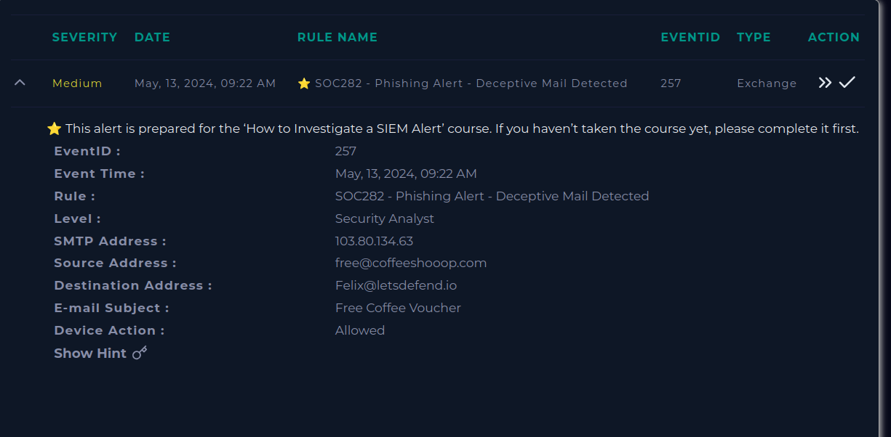
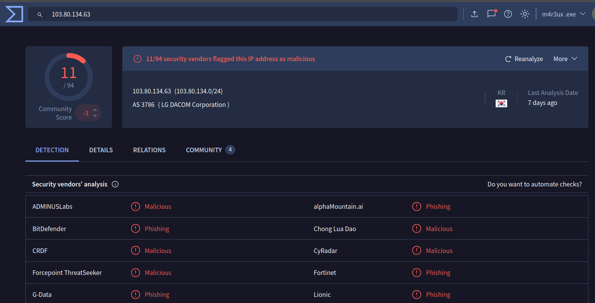
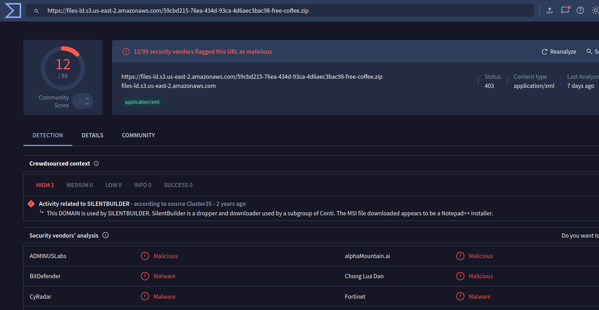
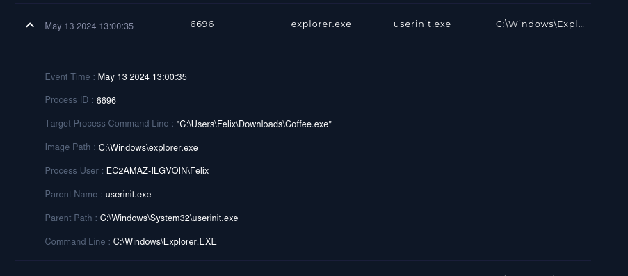
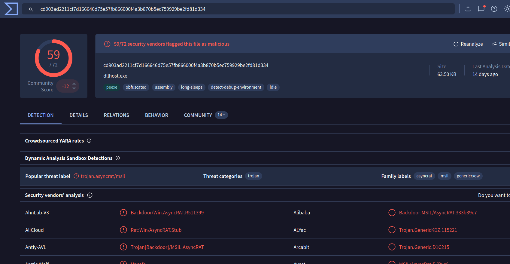
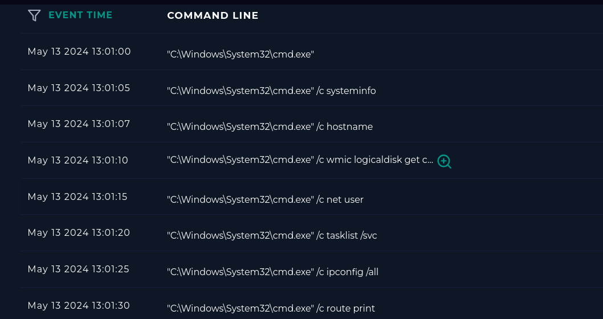
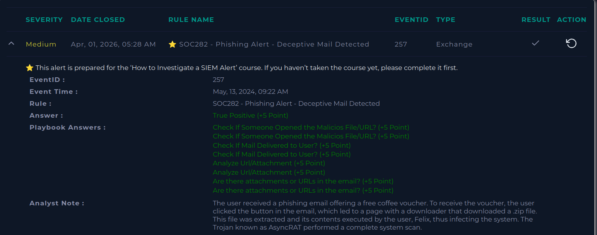

# Writeup — Investigação de Phishing (LetsDefend)  

Lab simulando a investigação de um evento em ambiente real de SOC a partir da plataforma LetsDefend.  

---  

## Detalhes do alerta  

- Regra: SOC282 - Phishing Alert - Deceptive Mail Detected    
- EventID: 257    
- Endereço SMTP: 103.80.134.63    
- Remetente: free@coffeeshooop.com    
- Assunto: Free Coffee Voucher    
- Ação do dispositivo: Permitir    

---  

## Análise inicial  

Ao analisar o endereço IP 103.80.134.63 no VirusTotal, foram identificadas diversas denúncias relacionadas a phishing.  

Além disso, o IP está geolocalizado na Coreia do Sul, o que pode indicar uso de infraestrutura suspeita ou comprometida para envio de campanhas maliciosas.  

---  

## Análise do e-mail  

Buscando pelo remetente free@coffeeshooop.com nos registros de e-mail do SIEM, foi possível identificar o conteúdo da mensagem.  

O e-mail se trata de uma oferta de café gratuito, incentivando o usuário a clicar em um botão para reivindicar o voucher, caracterizando uma tentativa de phishing baseada em engenharia social.  

---  

## Análise do link malicioso  

O link presente no e-mail direciona para:  

https://files-ld.s3.us-east-2.amazonaws.com/59cbd215-76ea-434d-93ca-4d6aecxxxxxx-free-coffee.zip

Esse link realiza o download de um arquivo .zip.  

Ao analisar a URL no VirusTotal, foram identificadas flags de atividade maliciosa, assim como no IP de origem.  

Além disso, foi identificado que:  

> Este domínio é utilizado pelo SilentBuilder, um downloader associado a um subgrupo do Conti.    
> O arquivo baixado se disfarça como instalador legítimo, como o Notepad++.  

Isso indica tentativa de mascarar malware como software confiável.  

---  

## Análise no SIEM  

Ao buscar pelo acesso ao link no SIEM, foi identificado que:  

- Às 12:59, o usuário Felix realizou o download do arquivo .zip disponibilizado no e-mail de phishing.  

---  

## Análise de processos no endpoint  

Após o download, analisando os processos no endpoint do usuário Felix, foram observados os seguintes eventos:  

- Download do arquivo .zip    
- Às 13:00:11, criação de processo de extração utilizando 7zip    
- Às 13:00:35, execução do arquivo extraído chamado Coffee.exe    

Isso confirma a interação do usuário com o arquivo malicioso e a execução do payload.  

---  

## Análise do arquivo  

Hash do arquivo:  

CD903AD2211CF7D166646D75E57FB866000F4A3B870B5EC759929BE2FD81D334

Ao analisar o hash no VirusTotal, foram identificadas diversas detecções classificando o arquivo como o trojan AsyncRAT.  

---  

## Comportamento do malware  

Após a execução, foram observadas atividades suspeitas no endpoint, incluindo a execução de comandos como:  

- hostname    
- wmic    
- net user    
- tasklist /svc    
- ipconfig    
- route print    

Esses comandos indicam atividades de enumeração do sistema, com o objetivo de coletar informações da máquina comprometida.  

---  

## Conclusão  

O usuário recebeu um e-mail de phishing oferecendo um voucher gratuito de café.  

Ao interagir com o conteúdo, clicou no link malicioso, realizou o download de um arquivo .zip, extraiu seu conteúdo e executou o arquivo Coffee.exe.  

Como resultado, o sistema foi comprometido pelo malware AsyncRAT.  

Após a execução, foram observadas atividades de enumeração no host, indicando que o malware iniciou coleta de informações da máquina comprometida, comportamento típico de um Remote Access Trojan (RAT).  

Dessa forma, trata-se de um ataque de phishing bem-sucedido, com comprometimento confirmado do endpoint, havendo risco de controle remoto da máquina, exfiltração de dados e possível movimentação lateral na rede.  

O incidente deve ser tratado como crítico e requer ações de contenção e resposta.  

---  

## Classificação  

- True Positive    
- Comprometimento confirmado    

---  

## Ação tomada  

O alerta foi escalado com todas as evidências coletadas, incluindo:  

- IOC (IP, URL e hash)    
- Evidência de interação do usuário    
- Execução do payload    
- Atividade maliciosa no endpoint  

